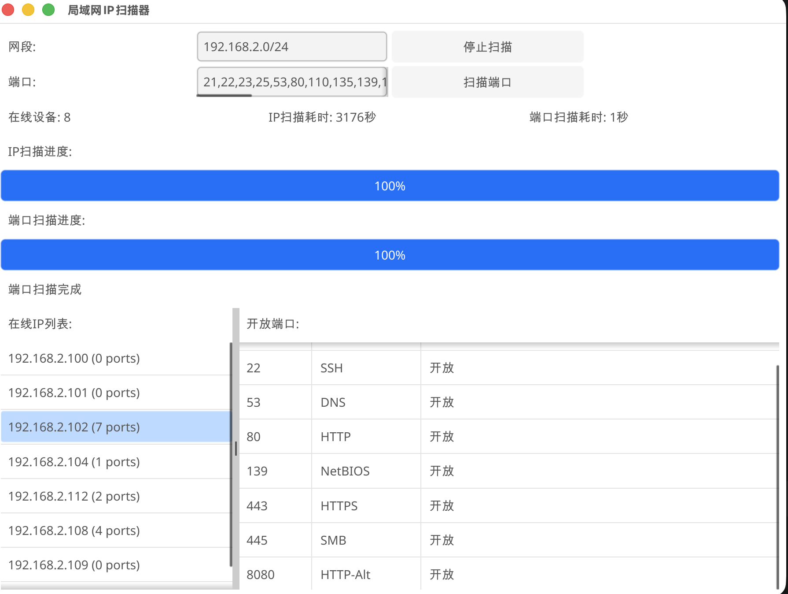

# 局域网 IP 扫描器 (NetScan)

一个用 Go 语言开发的高性能局域网 IP 和端口扫描工具，带有现代化的图形界面。

## ✨ 功能特点

- 🔍 **快速 IP 扫描** - 使用并发技术快速发现局域网内的在线设备
- 🚪 **智能端口扫描** - 支持自定义端口范围和常见服务端口识别
- 🎨 **友好 GUI** - 基于 Fyne 框架的跨平台桌面应用
- ⚡ **高性能并发** - Go 语言 goroutine 并发，速度极快
- 📊 **实时进度** - 显示扫描进度和在线设备数量
- 🔧 **高度可配置** - 支持自定义网段、端口范围和超时时间

## 📸 功能截图

### 主界面



- 左侧：在线 IP 列表（显示端口数量）
- 右侧：选中 IP 的开放端口详情
- 顶部：配置和控制区域
- 底部：进度条和状态显示

---

💡 **添加自己的截图**：
1. 运行程序 `./netscan`
2. 使用系统截图工具截取界面
3. 将截图保存为 `screenshots/main-ui.png`


## 🚀 快速开始

### 环境要求

- Go 1.16 或更高版本
- Git

### 安装运行

#### 1. 克隆项目

```bash
git clone https://github.com/kfsong/netscan.git
cd netscan
```

#### 2. 编译运行

```bash
# 编译项目
go build -o netscan main.go

# 运行程序
./netscan
```

或者直接运行（不编译）：

```bash
go run main.go
```

### 开发模式

```bash
# 安装依赖
go mod tidy

# 运行测试
go test -v ./...
```

## 💡 使用说明

### 1. 扫描在线 IP

1. 程序启动后会自动检测本机所在网段
2. 如需更改，在"网段"输入框中修改
3. 点击 **"扫描IP"** 按钮开始扫描
4. 等待扫描完成，左侧会显示所有在线设备

### 2. 扫描开放端口

1. 确保先完成了 IP 扫描
2. 在"端口"输入框中配置要扫描的端口
   - 格式示例：`21,22,80,443,8080-8090`
   - 默认预设了 25 个常见服务端口
3. 点击 **"扫描端口"** 按钮开始扫描
4. 点击左侧 IP 列表查看该 IP 的开放端口详情

### 3. 常用服务端口列表

程序默认包含以下常见服务端口识别：

| 端口 | 服务 | 说明 |
|------|------|------|
| 21 | FTP | 文件传输协议 |
| 22 | SSH | 安全外壳 |
| 23 | Telnet | 远程终端 |
| 25 | SMTP | 邮件发送 |
| 53 | DNS | 域名解析 |
| 80 | HTTP | Web服务 |
| 110 | POP3 | 邮件接收 |
| 135 | RPC | 远程过程调用 |
| 139 | NetBIOS | Windows网络 |
| 143 | IMAP | 邮件访问 |
| 443 | HTTPS | 安全Web |
| 445 | SMB | 文件共享 |
| 993 | IMAPS | 安全IMAP |
| 995 | POP3S | 安全POP3 |
| 1433 | MSSQL | SQL Server |
| 1521 | Oracle | Oracle数据库 |
| 3306 | MySQL | MySQL数据库 |
| 3389 | RDP | 远程桌面 |
| 5001 | Flask | Python Flask服务 |
| 5432 | PostgreSQL | PostgreSQL数据库 |
| 5900 | VNC | 远程控制 |
| 6379 | Redis | Redis缓存 |
| 8080 | HTTP-Alt | 备用HTTP |
| 8443 | HTTPS-Alt | 备用HTTPS |
| 27017 | MongoDB | MongoDB数据库 |

## 🛠 技术栈

- **语言**：Go 1.16+
- **GUI 框架**：[Fyne](https://fyne.io/)
- **网络库**：Go 标准库 net
- **并发模型**：Goroutines + Channels
- **跨平台**：Windows、macOS、Linux

## 🏗 项目结构

```
netscan/
├── main.go              # 主程序文件
├── go.mod               # Go 模块定义
├── go.sum               # 依赖锁定文件
├── netscan              # 编译后的可执行文件（可能）
├── README.md            # 项目说明文档
└── ...
```

## 🎯 核心功能

### IP 扫描器

- 使用 ICMP ping 协议（调用系统 ping 命令）
- 100 并发 goroutine 同时扫描
- 可自定义网段（默认自动检测）
- 完整的 C 类网段扫描（254 个地址）

### 端口扫描器

- 并发扫描技术（每 IP 20 并发）
- 支持单个端口和端口范围
- TCP 连接超时检测（800ms）
- 可自定义端口列表
- 实时更新扫描进度

## 📝 配置说明

### 并发度配置

在代码中可以调整以下常量：

```go
const (
    maxConcurrent = 100          // IP 扫描并发数
    maxConcurrentPortScanIPs = 10 // 端口扫描的 IP 并发数
    maxConcurrentPortsPerIP = 20   // 每个 IP 的端口扫描并发数
)
```

### 超时配置

```go
// 端口连接超时
800 * time.Millisecond

// Ping 超时
1 second
```

## 🤝 贡献指南

欢迎贡献代码、提交问题和改进建议！

1. Fork 本仓库
2. 创建特性分支 (`git checkout -b feature/AmazingFeature`)
3. 提交更改 (`git commit -m 'Add some AmazingFeature'`)
4. 推送到分支 (`git push origin feature/AmazingFeature`)
5. 开启 Pull Request

## 🐛 问题反馈

如果你发现了任何问题或有新的想法，请在 [Issues](https://github.com/kfsong/netscan/issues) 页面提交。

## 📄 许可证

本项目采用 MIT 许可证 - 查看 [LICENSE](LICENSE) 文件了解详情。

## 🙏 致谢

- [Fyne](https://fyne.io/) - 跨平台 GUI 框架
- Go 语言社区

---

**Made with ❤️ by [kfsong](https://github.com/kfsong)**

---

## 📌 Star History

如果你觉得这个项目对你有帮助，请给个 Star ⭐ 支持一下！

---

## 📋 待办功能

- [ ] ARP 扫描替代 Ping
- [ ] 导出扫描报告（CSV/JSON）
- [ ] 历史扫描记录
- [ ] 自定义主题和配色
- [ ] 网络拓扑图可视化
- [ ] 更多服务识别
- [ ] UDP 端口扫描
- [ ] 命令行版本
